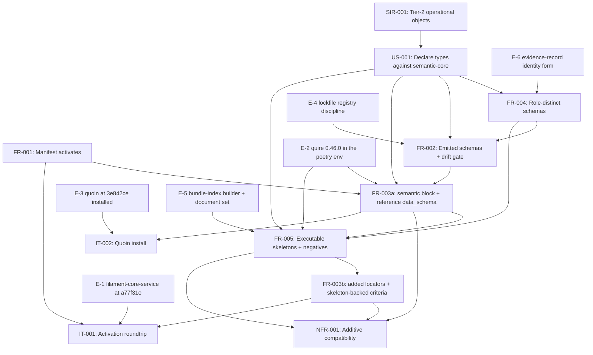

# SR-004: Dependency review of the issue #6 semantic module contract specification

## Summary

Dependency and ordering analysis of the `agent-ix/spec-objects-operational#6`
spec set (spec.md, FR-001..FR-005, NFR-001, IT-001, IT-002), with every named
external dependency verified read-only on 2026-09-04 against the upstream
checkouts, the registries, the installed toolchains, and the engine source that
implements the contract this module declares. The spec already absorbs the
sibling module's dependency dispositions (`agent-ix/spec-objects-business#4`
SR-004): the FR-002 ↔ FR-004 edge is reversed, the added-locator clause lives in
FR-005, FR-002-CON-4 states the lockfile discipline, FR-005 replaces the skip
clause with a hard failure naming `agent-ix/quire-rs#392`, and spec.md Out of
Scope names every blocker this review was asked to record. Those are confirmed
here rather than re-found.

What the read-only verification adds is four dependencies that are named in the
spec but do not join to the artifact on the other side. The
`agent-ix/quoin#267` operational evidence family — the one external record
family this module maps to rather than duplicates — identifies its records with
a bare-token `record_id`, which the `SemanticId` this module's `EvidenceRef`
requires cannot match, and that EPIC is CLOSED, so no ticket carries the
reconciliation. `validate_document`, the only engine entry point that emits the
`semantic.record-invalid` FR-005 rests on, builds its bundle index from module
imports alone, so the resolved-type outcome FR-005-AC-3 asserts is unreachable
through it. The alternate skeletons' deliberate id sharing collides with the
engine's ambiguity rule, so the same criterion fails at error severity once a
bundle index *is* supplied. And the committed lockfile resolves every package
from `npm.ix`, which is the opposite of what FR-002-CON-4 states.

Everything else the spec names exists and is at the stated version. The
problems are the joins, not the parts.

## Verdict

**Not ready for `spec-to-plan` as written.** Four highs (FND-400..FND-403) are
dependency joins that no requirement on either side closes; each has a stated
proposed disposition below and none of them is closed by relaxing a rule. Five
mediums are ordering and provisioning facts a plan must carry as explicit
tasks. The five lows are recorded; three of them are verifications that came
back clean and are stated so the plan does not re-check them.

This verdict speaks only for the dependency lens; the base review (SR-001,
CONDITIONAL) and the failure-domain review (SR-006, two highs) stand
separately, and FND-401/FND-402 sharpen SR-006's FND-208 with the engine
behaviour that makes it fail rather than merely dangle.

## Findings

| ID | Severity | Summary | Refs | Escape Cause |
|----|----------|---------|------|--------------|
| FND-400 | high | The `agent-ix/quoin#267` evidence family cannot be referenced by the form FR-004 requires. `EvidenceRef.record` is a semantic-core `SemanticId` (`^ix://[a-z0-9][a-z0-9._-]*/…`) and FR-004-AC-11 asserts a bare token is rejected, but quoin FR-059 identifies an operational evidence record with `record_id` matching `^[A-Za-z0-9][A-Za-z0-9._:/-]{0,127}$`, and the only shipped producer (quoin FR-061, `src/measurement/github-release-operational.ts`) mints `<record_prefix>-capability` and `<record_prefix>-exercise`. No record that exists today can be named by this module's schema. `EvidenceKind` (`exercise`, `execution`, `observation`, `review`) also has no stated correspondence to the family's own `record_shape` (`standing_capability`, `exercise`) or its 16-value `control_kind`. `agent-ix/quoin#267` is CLOSED (COMPLETED, 2026-09-01), so no open ticket owns the reconciliation, and the ticket's own gate says an evidence-record incompatibility blocks merge rather than minting a second family. | FR-004 Behavior (EvidenceRef bullets), FR-004-AC-11, FR-004-CON-3, spec.md Out of Scope, quoin FR-059, quoin FR-061 | missing-requirement |
| FND-401 | high | FR-005-AC-3 is unreachable through the entry point the rest of FR-005 uses. `validate_document(archetype, module_root, text)` — the function FR-005-AC-1 and all nine negative fixtures call, and the only site that emits `semantic.record-invalid` — constructs `BundleIndex::default()` and fills `imports` from the loaded modules only (`src/validate_document.rs:356`); `objects`, `enumerations` and `package` stay empty. Under it every non-kernel `Type` token yields the placeholder `ix://…/unresolved/<Token>` with `semantic.unresolved-type` reason `no-bundle-index`, so "zero `semantic.unresolved-type` findings, every non-kernel `type.target` starting `ix://agent-ix/spec-objects-operational/type/`" can only be produced by a separate `extract_semantic` call carrying a hand-built `bundle`. Building that index is nobody's requirement: `BundleIndex::from_documents` exists in quire's Rust only and is not on the Python surface, and FR-005 Inputs name no such builder. | FR-005-AC-1, FR-005-AC-3, FR-005 Inputs, quire-rs FR-070, `src/validate_document.rs`, `src/python/mod.rs` | missing-requirement |
| FND-402 | high | The deliberate id sharing of the alternate skeletons collides with the resolver FR-005-AC-3 depends on. FR-005 Behavior ships `configuration.sysml.md`, `sli.sysml.md` and `deployment.sysml.md` under the same frontmatter `id` and `title` as their table skeletons ("two files under one id by intent"), and a bundle index built from the skeleton frontmatter therefore holds two entries whose `names` both carry `ArtifactStoreConfiguration`. Quire's name resolution counts matching entries rather than distinct ids (`src/semantic/properties.rs:516`), so two matches raise `semantic.ambiguous-type` at **error** severity. `deployment.md` line 40 and `deployment.sysml.md` line 25 both declare `applied_configuration : ArtifactStoreConfiguration`, so FR-005-AC-3's "zero `error` diagnostics" fails as soon as the index of FND-401 is supplied. The spec never states which files the AC-3 index is built from. | FR-005 Behavior (alternate-skeleton bullets), FR-005-AC-3, skeletons `deployment.md`, `deployment.sysml.md`, `configuration*.md`, quire-rs FR-070 | wrong-requirement |
| FND-403 | high | FR-002-CON-4 states that `package-lock.json` resolves every public package from `registry.npmjs.org` and only `@agent-ix/semantic-core` from npm.ix. The lockfile on this branch resolves **75 of 75** entries from `http://npm.ix/` and none from `registry.npmjs.org`: it was generated on a machine whose npm config routes everything through the npm.ix fall-through mirror, so the TypeSpec toolchain, babel and inquirer trees all carry npm.ix tarball URLs. The constraint is false against the artifact it constrains, any regeneration on this machine reproduces it, and a lockfile carrying npm.ix URLs for public packages is barred by ecosystem policy independently of this spec. Either the lockfile is regenerated with `--@agent-ix:registry=` scoping only, or CON-4 is restated to describe what the mirror actually produces — but not both silently. | FR-002-CON-4, FR-002 Inputs, `package-lock.json` | correct-requirement-no-evidence |
| FND-404 | medium | FR-001 and IT-001 do not pin the filament-core-service revision that FR-003 Inputs pin (`a77f31e`, CR-003). FR-001 Behavior names "`module-manifest.schema.json` v1.0.0", which does not discriminate: the `$id` is `…/module-manifest/1.0.0.json` both before and after the semantic block was added. No release contains that revision (`git tag --contains a77f31e` is empty; latest tag v0.8.34, whose schema contains zero occurrences of `semantic`) and the top level is `additionalProperties: false`, so every released service rejects the 0.3.0 manifest. FR-001-AC-1/AC-2 and IT-001-SC-01..03 are satisfiable only against a service built from main. The plan must carry that build as an enablement task; the spec should pin the revision in FR-001 Behavior and IT-001 Preconditions as the sibling module did. | FR-001 Behavior, FR-001-AC-1, FR-001-AC-2, IT-001 Preconditions, FR-003 Inputs | missing-requirement |
| FND-405 | medium | FR-003-AC-3 and FR-003-AC-4 are verification-ordered *after* FR-005 although FR-005 `depends_on` FR-003. AC-4 runs `validate_document` on each skeleton, and AC-3 asserts that every locator added after 0.2.0 is `required: false` — but FR-005 Behavior is what mints those locators and rewrites those skeletons. The stated `depends_on` edges stay acyclic (the added-locator clause already moved to FR-005), so this is not a spec cycle; it is a verification edge running backwards, and a plan that treats FR-003 as one finished step will report two criteria green against 0.2.0 skeletons. Sequence FR-003 as a build step (block, digests, version) and a verify step after FR-005. | FR-003-AC-3, FR-003-AC-4, FR-003-CON-2, FR-005 Behavior (locator bullet) | wrong-requirement |
| FND-406 | medium | The Quire engine is not provisioned in the environment the tests run in: `poetry run python -c "import quire"` raises `ModuleNotFoundError` in this worktree. That is FR-005's intended state (fail, never skip), and the wheel is installable — pypi.ix carries `quire-0.46.0-cp39-abi3-manylinux_2_34_x86_64.whl`, ABI-compatible with the env's Python 3.13 — but the step is manual, unrepeatable in CI (`internal-pypi` serves 0.33.0 at most), and `agent-ix/quire-rs#392` is OPEN. Every semantic row of the matrix depends on one developer having run `make dev-quire`. The plan must carry provisioning as an explicit task and no workflow may report those rows. | FR-005 Inputs, FR-005 Behavior (`make dev-quire`, fail-not-skip), tests.md Test Environment, `agent-ix/quire-rs#392` | correct-requirement-no-evidence |
| FND-407 | medium | The negative fixtures depend on an engine behaviour no quire-rs criterion pins. `validate_document` reports only the **first** schema violation (`violations.next()`, `src/validate_document.rs:388`), so the `detail:` substring FR-005-AC-5 matches is whichever keyword the validator happens to reach first for that record. Nine fixtures rest on JSON Schema evaluation order across a sealed model with `contains`/`minContains`/`maxContains` clauses; a schema edit that reorders keywords changes the message without changing the refusal. The `detail:` discipline is right (it is what makes seven identical `semantic.record-invalid` codes distinguishable) but the substring must be chosen from the schema *path*, which is stable, rather than the message tail. | FR-005 Behavior (`detail:` bullets), FR-005-AC-5, `src/validate_document.rs` | correct-requirement-no-evidence |
| FND-408 | medium | The `semantic.record-invalid` diagnostic that FR-005 Outputs, FR-005-AC-1 and seven negative fixtures depend on appears in no quire-rs acceptance criterion: `grep -rn record-invalid quire-rs/spec/functional/*.md` returns nothing, while the code emits it from `src/validate_document.rs:399` and `src/filament.rs:1206`. FR-005 Dependencies already records this as an unpinned neighbour contract owned by `agent-ix/quire-rs#391`; the verification confirms it and the plan must not treat the code as a stable published contract until #391 settles it. Recorded, no change proposed here. | FR-005 Dependencies, FR-005-AC-1, `agent-ix/quire-rs#391` | correct-requirement-no-evidence |
| FND-409 | low | IT-002 and FR-003-AC-5 depend on an unreleased Quoin. The installed CLI reports `0.23.1-2-g3e842ce`, which is exactly the build IT-002 Preconditions describe, so the dependency is satisfied on this machine — but no tag contains `3e842ce` (latest v0.23.1) and `agent-ix/quoin#290` gates publication of the semantic module packages. TC rows over IT-002 are green on one machine only, which IT-002 already states. | IT-002 Preconditions, FR-003-AC-5, `agent-ix/quoin#290` | correct-requirement-no-evidence |
| FND-410 | low | The NFR-001 baseline dependency is satisfied but unpinned. `tests/fixtures/baseline-0.2.0/manifest.yaml` and all eight `baseline-0.2.0/skeletons/*.md` are byte-identical to `HEAD` (`7811678`), so the population NFR-001 measures is the real 0.2.0 set today — verified, not assumed. Nothing records the revision it was captured from, so a later refresh taken after the 0.3.0 rewrite would make NFR-001-AC-2/AC-4 vacuous with every row still green. Naming the revision in NFR-001 Verification closes it. This is the provisioning half of SR-006's FND-214. | NFR-001 Statement, NFR-001 Verification, `tests/fixtures/baseline-0.2.0/` | missing-requirement |
| FND-411 | low | FR-003 Inputs' claim that Quoin and Quire vendor the manifest schema byte-identically is verified: `quoin/src/semantic/schemas/module-manifest.schema.json`, `quire-rs/schemas/vendored/module-manifest.schema.json` and this module's `tests/fixtures/module-manifest.schema.json` all hash to `sha256:69cf9738…`, equal to filament-core-service at `a77f31e`. One wrinkle for the plan: filament-core-service ships **two** copies of that schema and they differ (`filament_core_service/schemas/` carries the FR-040 `edge_types`/`roles` registries, `spec/schemas/` does not), so "the FR-035 schema" names two files upstream. This module vendors the runtime copy, which is the right one. Recorded, no change. | FR-003 Inputs, FR-001-AC-1 | correct-requirement-no-evidence |
| FND-412 | low | Every remaining external dependency the spec names is present at the stated version and every blocker it records is genuinely open: `@agent-ix/semantic-core` 0.1.0 on npm.ix and in `node_modules`; `tsp` 1.15.0 with both toolchain packages pinned exactly; quoin main `3e842ce` carrying FR-070..FR-075; quire-rs main `17b80e4` carrying FR-069..FR-072; filament-core-service main `a77f31e` carrying FR-026/FR-034/FR-035; filament-core-data FR-031..FR-036. OPEN: quire-rs#392, #221, #394, #391; filament-core-service#23; quoin#335, #290, #291; filament-core-data#11, #21, #22, #23; spec-objects-operational#5; quire-contract-ir#52; filament-core-data#36. CLOSED: quoin#267 (see FND-400). Recorded so the plan does not re-verify. | spec.md References, spec.md Out of Scope | correct-requirement-no-evidence |
| FND-413 | low | `spec.md` frontmatter declares `depends_on: []` while the same file's `relationships` block declares four `depends_on` targets (filament-core-service FR-035, filament-core-data FR-031, quoin FR-070, quire-rs FR-069). A consumer reading the module-level dependency list sees a module with no upstream dependencies, which is the opposite of what this review found. Populate the field or drop it. | spec.md frontmatter | wrong-requirement |

## Finding Detail

### FND-400 (high): the evidence reference names records that cannot exist

`EvidenceRef.record` is emitted as a `$ref` to
`https://schemas.agent-ix.org/semantic-core/0.1.0/SemanticId.json`, whose
pattern is `^ix://[a-z0-9][a-z0-9._-]*/[A-Za-z0-9][A-Za-z0-9._~:/-]*$`. The
record family it is supposed to name identifies its records with
`$defs/identity` = `^[A-Za-z0-9][A-Za-z0-9._:/-]{0,127}$`, and the shipped
GitHub-release producer writes `record_id` values of the form
`<record_prefix>-capability` / `<record_prefix>-exercise`. An `ix://` string
would be *admissible* as a `record_id`, but nothing on the quoin side mints
one, and this module's schema *refuses* every id the producer actually writes.

The consequence is not a failing test — no test can fail, because FR-004-AC-11
supplies its own well-formed `SemanticId` — it is that the ticket's acceptance
criterion "operational evidence has one canonical semantic mapping" is
discharged structurally (one model declares `evidence`) while the mapping joins
to nothing. SR-006's FND-206 names the same key from the failure-domain side;
this finding is the upstream half: the target family's identity form.

Proposed disposition (no rule relaxed): state in FR-004 Behavior which side
mints the `ix://` identity for an operational evidence record — either quoin
gains that identity (a new issue, since #267 is closed) or this module states
the deterministic mapping from a `record_id` to `ix://agent-ix/quoin/evidence/<record_id>`
and names it as the reader rule the extractor applies. Record the
`EvidenceKind` ↔ `record_shape`/`control_kind` correspondence in the same
place, or narrow `EvidenceKind` to the two shapes the family actually has.

### FND-401 and FND-402 (high): the two halves of bundle resolution

These are one dependency read twice. FR-005 asserts three things about types:
that every skeleton validates through `validate_document` (AC-1), that under a
bundle index every non-kernel `type.target` resolves under
`ix://agent-ix/spec-objects-operational/type/` with zero unresolved findings
(AC-3), and that titles are unique `Identifier`s so a `Type` cell can name them
(AC-8).

`validate_document` cannot satisfy AC-3: its bundle carries imports only, so
resolution falls through to the placeholder branch with reason
`no-bundle-index`. The finding is not that AC-1 breaks — the unresolved
diagnostic is advisory, so AC-1 still passes — it is that the two criteria run
different engine paths and only one of them is provisioned by anything the
spec names.

Supplying the index makes the second half fail. `from_documents` keys entries
by frontmatter `id`, with `names` gathered from `id`, `title` and `name`; the
three alternate skeletons duplicate both `id` and `title`, and the resolver's
ambiguity test is `by_name.len() > 1` over matched *entries*, not over distinct
ids. `ArtifactStoreConfiguration` is named by two entries, and `deployment.md`
declares a field of that type, so the index that AC-3 needs produces
`semantic.ambiguous-type` at error severity for the very artifact AC-3 checks.

Proposed disposition: state in FR-005 which documents the AC-3 index is built
from (the eight table skeletons, with the alternates validated but excluded),
and state that the index is built by this module's test harness from
frontmatter, naming the shape (`package`, `objects[{id, names}]`,
`enumerations`, `imports`) it must produce. If the alternates are to be in the
index, then de-duplication by `id` is a quire defect and needs an issue on
`agent-ix/quire-rs` before AC-3 can be written at all.

## External Dependency Verification

Read-only checks performed 2026-09-04. "Stated" is what the spec names; "Found"
is what exists.

| Dependency | Stated | Found | Status |
|---|---|---|---|
| `@agent-ix/semantic-core` | 0.1.0 from npm.ix | `npm view` on npm.ix: 0.1.0; `node_modules/@agent-ix/semantic-core` 0.1.0; `SemanticId` pattern `^ix://…`, `Identifier`, `UnitSymbol`, `FieldDecl.type.unit` all as FR-004 reads them | exists, correct version |
| TypeSpec toolchain | compiler and emitter 1.15.0, exact pins | both exact in `devDependencies`; `npx tsp --version` 1.15.0 | exists, correct version |
| `package-lock.json` registries | public packages from registry.npmjs.org, semantic-core from npm.ix | 75/75 entries resolve from `http://npm.ix/`; 0 from registry.npmjs.org | contradicts FR-002-CON-4 (FND-403) |
| quoin | main at/after `3e842ce`, FR-070..FR-075 | main HEAD `3e842ce`; all six FR files present; installed CLI `0.23.1-2-g3e842ce` | exists; unreleased (FND-409) |
| quire-rs (engine) | main, FR-069..FR-072; wheel 0.46.0 with `extract_semantic` | main HEAD `17b80e4`; FR-069..FR-072 present; Python surface exposes `extract_semantic`, `validate_document`, `validate_manifest`, `Registry`; `quire` CLI reports engine 0.46.0 | exists on main; untagged |
| quire wheel in the test env | provisioned by `make dev-quire` | `import quire` fails in the poetry env; pypi.ix serves `quire-0.46.0-cp39-abi3-manylinux_2_34_x86_64.whl` (abi3, installs on 3.13) | installable, not installed (FND-406) |
| `semantic.record-invalid` | FR-005 Outputs and AC-1 | emitted by `src/validate_document.rs:399` and `src/filament.rs:1206`; named by no quire-rs acceptance criterion | code only (FND-408) |
| `semantic.unresolved-type`, `semantic.ambiguous-type`, `semantic.invalid-type-token`, `semantic.properties-both-forms`, `semantic.dangling-clause-ref` | FR-004-AC-12, FR-005 Behavior | all present in quire-rs; `unresolved` carries reasons `unknown-token`, `no-bundle-index`, `import-unresolved` (quire-rs FR-070-AC-4) | exists |
| module-manifest schema (FR-035) | revision `a77f31e`, vendored byte-identically by Quoin and Quire | `sha256:69cf9738…` in quoin, quire-rs and this module's fixtures, equal to filament-core-service `a77f31e`; no tag contains `a77f31e`; v0.8.34's schema has no `semantic` block; the service's `spec/schemas/` copy differs from its runtime copy | exists on main only (FND-404, FND-411) |
| quoin FR-071 reader conventions | `Duration [ms]` → `type.unit`; `identity` flag | quoin FR-071 lines 39 and 41 state both exactly as FR-004 reads them | exists |
| `agent-ix/quoin#267` evidence family | referenced by `SemanticId`, never copied | EPIC CLOSED (COMPLETED); family shipped as quoin FR-059 + `src/measurement/schemas/operational-evidence-v1.schema.json`; `record_id` is a bare-token pattern; producer mints `<prefix>-capability`/`-exercise` | exists; unjoinable (FND-400) |
| 0.2.0 baseline | "the checked-in 0.2.0 skeleton set" | `tests/fixtures/baseline-0.2.0/` manifest and all eight skeletons byte-identical to `HEAD` | exists, faithful (FND-410) |
| filament-core-data FR-031..FR-036 | referenced by spec.md, FR-002, FR-004 | all present | exists |
| Blocking issues | quire-rs#392/#221/#394/#391, filament-core-service#23, quoin#335/#290/#291, filament-core-data#11/#21/#22/#23, spec-objects-operational#5 | all OPEN | recorded correctly |

## Classification

| Requirement | Class | Rationale |
|-------------|-------|-----------|
| StR-001 | Feature (root need) | Stakeholder need for extractable operational graph entities; implements nothing itself |
| US-001 | Feature (root story) | Maintainer story realised by FR-002..FR-005 |
| FR-001 | Enablement | Manifest activation against filament-core; satisfied at 0.2.0 and the precondition for every manifest change |
| FR-002 | Enablement | TypeSpec toolchain, generator, `$id` normalization, drift gate, packaging; no behaviour an author sees |
| FR-003 | Enablement | Manifest `semantic` block, reference-form `data_schema`, locator and lexicon preservation; a contract, not a behaviour |
| FR-004 | Feature | The role-distinct schemas are what authors, reviewers and the downstream frontends consume |
| FR-005 | Feature | Executable skeletons and negative fixtures are the module's user-visible authoring contract |
| NFR-001 | Constraint | Additive-compatibility bound over FR-003, FR-004 and FR-005; implements nothing |
| IT-001 | Verification | Verifies FR-001 against a running filament-core-service |
| IT-002 | Verification | Verifies FR-003 against a Quoin built from main |

Enablement outside the FR set that the plan must carry as explicit tasks. None
has a requirement of its own today.

1. E-1 — a filament-core-service built from main at/after `a77f31e` for IT-001 (FND-404).
2. E-2 — the quire 0.46.0 wheel installed into the module's poetry env via `make dev-quire` (FND-406).
3. E-3 — a Quoin built from main at/after `3e842ce` on `PATH` for IT-002 (FND-409); satisfied on the current machine.
4. E-4 — a `package-lock.json` whose public packages resolve from registry.npmjs.org, or a restated FR-002-CON-4 (FND-403).
5. E-5 — a bundle-index builder for the FR-005-AC-3 harness, with the document set it is built from stated (FND-401, FND-402).
6. E-6 — the `ix://` identity form for an operational evidence record, agreed with the quoin evidence programme (FND-400).

## Dependency Graph

Edges are the prerequisites the spec states, with the FR-003 verification split
of FND-405 shown as FR-003a (block, digests, version) and FR-003b (locator
additions and skeleton-dependent criteria). External prerequisites appear as
E-1..E-6.

External prerequisites by requirement. Each is a hard edge; the artifact is
named under FND-400..FND-412 where it is unreleased, unprovisioned, or
unjoinable.

| Requirement | External prerequisite |
|---|---|
| FR-001 | filament-core-service FR-026, FR-034, FR-035 at `a77f31e`; a service build carrying it |
| FR-002 | semantic-core 0.1.0 (filament-core-data FR-031, FR-033); TypeSpec 1.15.0; an npm resolution path for both |
| FR-003 | quoin FR-070, FR-073; quire-rs FR-069; the manifest schema with the `semantic` block; quire 0.46.0 for the loader criteria |
| FR-004 | semantic-core 0.1.0 grammar (filament-core-data FR-031, NFR-014); quoin FR-071 reader conventions; the `agent-ix/quoin#267` evidence family identity |
| FR-005 | quoin FR-071, FR-072; quire-rs FR-070, FR-071, FR-072; quire wheel 0.46.0; a bundle index the engine's Python surface does not build |
| NFR-001 | quoin FR-074; the checked-in 0.2.0 baseline |
| IT-001 | a running filament-core-service at/after `a77f31e` |
| IT-002 | quoin FR-070, FR-073, FR-075 built from main at/after `3e842ce` |

## Topological Order (suggested implementation sequence)

1. Enablement, parallelizable: E-4 (lockfile), E-2 (`make dev-quire`), E-3 (quoin build), E-6 (evidence identity agreed with the quoin programme), E-1 (service build for IT-001 only).
2. FR-002 toolchain half: generator, `$id` normalization, `--check` purity, `.gitattributes`, packaging. It compiles an empty-but-valid source, so it can start beside step 3.
3. FR-004: the eight object-type models and the support models in `typespec/main.tsp`, with schema-level positive and negative record tests. Blocked on E-6 for `EvidenceRef` only.
4. FR-002 emitted-set half: `toolchain.json`, digests, wheel and npm tarball inclusion, drift gate over the real set.
5. FR-003a: manifest `version: 0.3.0`, `semantic` block, reference-form `data_schema`, lexicon repair, loader criteria that do not read skeletons.
6. E-5 then FR-005: the bundle-index harness and its document set decided first, then the skeleton rewrite, the alternates, and the negative fixtures.
7. FR-003b: the `required: false` locators FR-005 introduced, plus FR-003-AC-3 and FR-003-AC-4 re-run against the rewritten skeletons.
8. NFR-001 verification against the 0.2.0 baseline; IT-002 demonstration; IT-001 against the E-1 build.

Steps 2 and 3 are the only genuinely parallel pair. Everything after step 3
consumes the previous step's bytes — emitted schemas, then digests, then
locators, then skeletons — so there is no further parallelism to claim.

## Cycles

None in the stated `depends_on` edges. FR-002 `depends_on` FR-004 with FR-004
naming FR-002 only as its build, and the added-locator clause already lives in
FR-005, so both cycles the sibling module found (SR-004 FND-144, FND-145) are
absent here.

One verification edge runs backwards and is recorded as FND-405 rather than as
a cycle: FR-003-AC-3 and FR-003-AC-4 read artifacts FR-005 produces, while
FR-005 `depends_on` FR-003. The FR-003a/FR-003b split in the graph above is the
proposed disposition; it changes the plan's sequencing, not the spec's edges.

## Proposed Dispositions

Findings and proposals only. No spec artifact is edited by this review.

| Finding | Proposed disposition |
|---|---|
| FND-400 | File the reconciliation issue against the quoin evidence programme (quoin#267 is closed) and state in FR-004 Behavior which side mints the `ix://` identity, plus the `EvidenceKind` ↔ `record_shape`/`control_kind` correspondence. Do not widen `EvidenceRef.record` to admit bare tokens. |
| FND-401 | State in FR-005 that the AC-3 index is built by this module's harness via `extract_semantic`, name its shape, and say plainly that `validate_document` resolves imports only, so AC-1 and AC-3 exercise different paths by design. |
| FND-402 | Name the documents the AC-3 index is built from (the eight table skeletons), or file a quire-rs issue for de-duplication by `id` before asserting zero error diagnostics over an index containing the alternates. |
| FND-403 | Regenerate `package-lock.json` with `@agent-ix` scoped to npm.ix and everything else on registry.npmjs.org, or restate FR-002-CON-4 to describe the mirror. The lockfile and the constraint must agree before FR-002 is planned. |
| FND-404 | Pin `a77f31e` in FR-001 Behavior and IT-001 Preconditions, matching FR-003 Inputs, and carry the service build as E-1. |
| FND-405 | Sequence FR-003 in two steps in the plan (block/digests, then skeleton-backed criteria); no spec edit required if the plan carries the split. |
| FND-406 | Carry `make dev-quire` as an explicit plan task and state in the plan that no CI workflow reports the semantic rows while `agent-ix/quire-rs#392` is open. |
| FND-407 | Choose each `detail:` substring from the failing schema *path* rather than the message tail, and say so in FR-005 Behavior. |
| FND-408 | Recorded, no change. FR-005 Dependencies already names the gap and `agent-ix/quire-rs#391` owns it. |
| FND-409 | Recorded, no change. IT-002 Preconditions already state the build and that no release tag carries the installer. |
| FND-410 | Name the revision the baseline was captured from in NFR-001 Verification, so a later refresh cannot silently empty the measurement. |
| FND-411 | Recorded, no change. Verified byte-identical; the service's two divergent copies are that repo's concern, and this module vendors the runtime one. |
| FND-412 | Recorded, no change. Verification result only. |
| FND-413 | Populate `depends_on` in `spec.md` frontmatter with the four upstream targets its `relationships` already names, or drop the field. |
