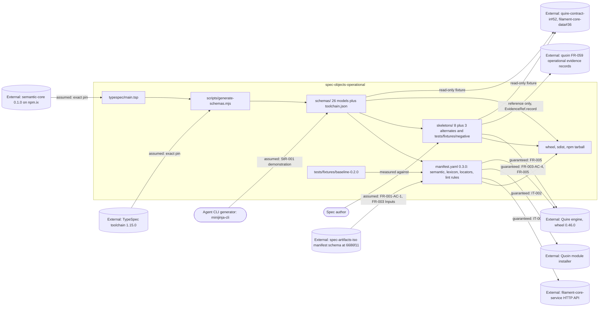

# SR-008: Scope and boundary review of the #6 semantic module contract spec

## Summary

This analysis drew the boundary of `spec-objects-operational` as specified on
`spec/6-semantic-module-contract`, allocated every StR/US/FR/NFR/IT to an
owning component and responsibility class, and checked each responsibility the
spec claims, disclaims, or leans on against the artifact on the other side:
quoin FR-059 (the operational evidence record family this module maps to),
quoin FR-070..FR-075 (semantic contract, mappings, `data_schema` by digest,
legacy forms, package manifests), quire-rs FR-069..FR-072 (load contract,
extraction, record surface), filament-core-data FR-031..FR-034 (semantic-core
grammar and projection), filament-core-service FR-035 (module-manifest schema),
the shipped implementation on this worktree (`typespec/main.tsp`, the 27 files
under `spec_objects_operational/schemas/`, the eleven skeletons, `tests/`), and
the neighbour tickets the spec names (`agent-ix/quoin#267`, `#290`, `#291`,
`#335`, `agent-ix/quire-rs#391`, `#392`, `agent-ix/filament-core-service#23`,
`#26`).

The three boundaries the ticket cares about are drawn correctly in the text.
The module edits no corpus repository and no vendored fixture: the diff for
this branch touches 101 files, all inside this repository. It changes no
runtime control behaviour: the package is Markdown, YAML and JSON, and every
model refuses execution state through its seal and its occurrence-row ban. And
it maps to `agent-ix/quoin#267` rather than duplicating it: exactly one model
(`Incident`) declares `evidence`, that key holds a reference (`EvidenceRef`),
and no model copies an evidence record field.

Eight findings: six medium, two low, no high. They are all at the edges, not in
the middle. Two are owners who have not claimed what the spec hands them
(`agent-ix/quoin#335` is scoped to the *business* module's keys and names none
of this module's; `agent-ix/quoin#267` is closed and no successor carries the
evidence reconciliation). Two are boundary rules the spec states and nothing
discharges (the map-don't-duplicate rule, and the no-runtime-control rule).
Two are boundary contracts judged against the wrong artifact (IT-001 activates
against a service whose own manifest schema refuses this manifest, and the
semantic-core `$ref` grammar is resolved at validation time from the
*consumer's* vendored bundle, which nothing pins to the module's build-time
copy).

## Verdict

**Conditional pass.** The In Scope / Out of Scope split in `spec/spec.md` is
sound, the three boundary questions the ticket poses are answered correctly by
the text and by the implementation, and no requirement in FR-002..FR-005
duplicates a quoin, quire-rs, or filament-core-data responsibility outright.
Before `spec-to-plan`, the six mediums need a disposition: FND-800 and FND-801
need real owners named (a ticket whose scope covers this module's keys, and a
live successor to the closed evidence EPIC), FND-802 and FND-804 need the two
unverified boundary rules given evidence or restated as recorded limits,
FND-803 needs IT-001's activation outcome stated against
`agent-ix/filament-core-service#26`, and FND-805 needs the semantic-core bundle
digest pinned. None of these moves the module's boundary. They close gaps at
its edges.

## System Context

## In-Scope Responsibilities

What the module guarantees (spec.md In Scope, FR-001..FR-005, NFR-001):

- Publish `manifest.yaml` conforming to the FR-035 module-manifest schema and
  activating idempotently against `POST /api/v1/modules/activate` (FR-001).
- Author one TypeSpec model per operational object type importing
  `@agent-ix/semantic-core` 0.1.0, and emit one JSON Schema 2020-12 file per
  model with the official emitter at a pinned toolchain, with the `$id`,
  `$ref`, determinism, version-embedding and drift-gate rules (FR-002).
- Carry the quoin FR-070 `semantic` block and reference-form `data_schema`
  (path plus SHA-256) for all eight exported object types at manifest version
  0.3.0, keeping every 0.2.0 locator, lint rule and lexicon term unchanged, and
  restoring the three definitions `agent-ix/spec-objects-operational#5` records
  as truncated (FR-003).
- Give each of the eight types a role-distinct declaration schema with its own
  required, optional and forbidden keys and item rules, dividing seven standing
  definitions from the one observed execution (`Incident`), refusing
  accumulated observations through the seal and the occurrence-row ban, and
  referencing the `agent-ix/quoin#267` evidence family through exactly one key
  on exactly one model (FR-004).
- Ship every skeleton as an executable positive fixture in the quoin
  FR-071/FR-072 Markdown forms, with three alternate `sysml` forms and ten
  negative fixtures pinning what the schemas refuse (FR-005).
- Keep the change additive over the checked-in 0.2.0 population: locators, lint
  rule and lexicon term set unchanged, yields byte-identical, every 0.2.0
  skeleton still validating (NFR-001).
- Package the schemas beside the manifest in the wheel, sdist and npm tarball
  (FR-002).

What the module explicitly disclaims (spec.md Out of Scope), and to whom:

| Disclaimed responsibility | Named owner | Owner status |
|---|---|---|
| `filament-core-service` behaviour | filament-core-service FR-035 | Live |
| Deployment topology of consuming clusters | Operating environment | Not a repository; see FND-804 |
| The `agent-ix/quoin#267` evidence record family: its shape, storage, lifecycle | quoin FR-059 / `agent-ix/quoin#267` | EPIC **closed**; see FND-801 |
| Runtime control behaviour (deploy, scale, migrate, page, roll back) | Operating environment | Asserted, unverified; see FND-804 |
| Accumulated observations of any kind | Refused by every seal; reached through an evidence reference | Enforced by FR-004-CON-4/CON-5 |
| Generated-language fixtures for the operational types | filament-core-data #21/#22/#23 behind `agent-ix/quoin#290` | Live |
| Extraction of the twenty declared-but-unextracted keys | `agent-ix/quoin#335` (mapping), quire-rs (extractor) | Ticket exists but is scoped to another module; see FND-800 |
| Naming what a module load refused | `agent-ix/quire-rs#221`, `#394` | Live, carried as expected failures |
| Record validation of a legacy artifact declaring `object:` | `agent-ix/quire-rs#391` | Live, carried as an expected failure |
| Publishing the Quire 0.46.0 wheel to a committable index | `agent-ix/quire-rs#392` | Live |
| Reconciling the three divergent FR-035 schema copies | `agent-ix/filament-core-service#26` | Live; but see FND-803 |
| Resolving a reference-form `data_schema` at activation | `agent-ix/filament-core-service#23` | Live |
| Editing any corpus repository or vendored fixture, and the legacy sweep | `agent-ix/quoin#291` | Live; held on this branch (101 files, all in-repo) |
| Application database schema generation | Nobody: no DDL is produced | Correct disclaimer |

## External Dependencies

| Dependency | Type | Assumed or Guaranteed | Contract |
|------------|------|------------------------|----------|
| filament-core-service activation API and catalog endpoints | HTTP | Guaranteed | IT-001; FR-001-AC-2..4 |
| FR-035 module-manifest schema as `agent-ix/spec-artifacts-iso` ships it at `6686f11` | JSON Schema, vendored by Quoin and Quire | Assumed | FR-003 Inputs; FR-001-AC-1 (which still names only "v1.0.0", SR-004 FND-404). The service's own copy admits neither block (FND-803) |
| Quoin module installer (FR-070, FR-073, FR-075), main at `3e842ce` | Local CLI over the filesystem | Guaranteed | IT-002; FR-003-AC-5 |
| Quire engine: loader FR-069, extraction FR-070/FR-071, record surface FR-072 | Python wheel 0.46.0+ from `pypi.ix` via `make dev-quire` | Guaranteed | FR-003-AC-4, FR-005-AC-1..9, NFR-001; no IT artifact by design (spec.md Requirements Architecture) |
| `semantic.record-invalid` diagnostic | Quire source only, no quire-rs AC | Assumed | Recorded in FR-005 Dependencies against `agent-ix/quire-rs#391` (SR-004 FND-408) |
| `@agent-ix/semantic-core` 0.1.0 from npm.ix, at build time | npm devDependency | Assumed | Exact pin in `package.json`; `$ref` host/version check FR-002-AC-3 |
| The semantic-core 0.1.0 **bundle a consumer resolves `$ref`s against** at validation time | Vendored snapshot (quire-rs `schemas/vendored/semantic-core/0.1.0`, filament-core-data `d48b8da`, `bundleDigest sha256:dd33c886…`) or `node_modules` for this repo's own harness | Assumed, **unpinned** | None. `toolchain.json` records name and version only (FND-805) |
| `@typespec/compiler` / `@typespec/json-schema` 1.15.0 | npm devDependencies | Assumed | Exact pin plus `package-lock.json` (whose registry hosts contradict FR-002-CON-4, SR-004 FND-403); versions recorded in `toolchain.json` |
| quoin FR-059 operational evidence records | Referenced by `SemanticId`, never read by this module | Assumed | No contract. Identity form does not join (SR-004 FND-400); non-duplication unverified (FND-802); no live owner (FND-801) |
| quoin FR-071/FR-072 Markdown mappings for `## Properties`, `## Invariants`, `## Operations` | Published mapping consumed by Quire | Assumed | FR-005 authors to the published forms |
| A mapping for the other twenty declared keys | `agent-ix/quoin#335` | Assumed | The ticket names none of this module's keys (FND-800) |
| Corpus repositories | Downstream, never edited | Assumed | FR-005-CON-1; NFR-001 Scope; `agent-ix/quoin#291` |
| `agent-ix/quire-contract-ir#52`, `agent-ix/filament-core-data#36` | Downstream read-only fixture consumers | Assumed | No stated fixture surface (FND-806) |
| Agent CLI generators (`minijinja-cli`) | Consumer | Assumed | StR-001 demonstration only; SR-002 FND-100 already asks for "skeletons" over "templates" |

## Responsibility Allocation

Components: **Module build** (`typespec/`, `scripts/generate-schemas.mjs`,
`make schemas` / `schemas-check`), **Module manifest**
(`spec_objects_operational/manifest.yaml`), **Fixture set** (`skeletons/`,
`tests/fixtures/negative/`, `tests/fixtures/baseline-0.2.0/`), **Packaging**
(wheel, sdist, npm staging), **Integration harness** (the IT procedures and the
neighbour CLIs and services they drive).

| Requirement | Owning Component | Class |
|-------------|------------------|-------|
| StR-001 (extractable operational graph entities) | Module manifest | core |
| US-001 (declare operational objects against semantic-core) | Module build | core |
| FR-001 (manifest activates against filament-core) | Module manifest | infrastructure |
| FR-002 (emit JSON Schemas from TypeSpec, drift gate) | Module build | core |
| FR-002-AC-6, FR-002-AC-7, FR-002-CON-2 (wheel, npm tarball, no `.npmrc`) | Packaging | infrastructure |
| FR-002-AC-11, FR-002-AC-13 (`make lint` wiring, toolchain provisioning) | Module build | cross-cutting |
| FR-003 (semantic block, digests, locator/lint/lexicon stability) | Module manifest | core |
| FR-003-AC-5 (Quoin install demonstration) | Integration harness | cross-cutting |
| FR-004 (role-distinct declaration schemas, evidence mapping) | Module build | core |
| FR-005 (executable skeletons, alternates, negative fixtures) | Fixture set | core |
| FR-005 fail-not-skip rule and `make dev-quire` | Fixture set | cross-cutting |
| NFR-001 (additive compatibility over the 0.2.0 baseline) | Module manifest | cross-cutting |
| IT-001 (activation roundtrip) | Integration harness | infrastructure |
| IT-002 (Quoin install with the semantic contract) | Integration harness | infrastructure |

Responsibilities the spec names that belong to a neighbour, allocated there and
not here:

| Responsibility | Owner | Where the neighbour claims it |
|----------------|-------|-------------------------------|
| Reject an unknown `semantic` key, an unknown export, a bad `package`, a digest mismatch, an unshipped `$ref`, a path escape at install | Quoin | quoin FR-070, FR-073 |
| Derive `semantic/package-manifest.json` and record per-export digests | Quoin | quoin FR-075 |
| Legacy-form detection and the sweep report | Quoin (policy), Quire (detection) | quoin FR-074 |
| Fail an object type with a `semantic.*` reason at load, record the digest | Quire | quire-rs FR-069 |
| `## Properties` to `FieldDecl[]`, type-token resolution, `semantic.unresolved-type` | Quire, mapping published by Quoin | quoin FR-071, quire-rs FR-070 |
| `## Invariants` / `## Operations` to `ClauseRef[]` / `OperationDecl[]` | Quire, mapping published by Quoin | quoin FR-072, quire-rs FR-071 |
| `availability` states and the `semantic` record surface | Quire | quire-rs FR-072 |
| semantic-core grammar, scalars, JSON Schema projection, IR lowering | filament-core-data | FR-031..FR-034 |
| The `semantic` and `lexicon` blocks in the module-manifest schema | filament-core-service, vendored through spec-artifacts-iso | FR-035; divergence `agent-ix/filament-core-service#26` |
| The operational evidence record: shape, identity, storage, lifecycle | quoin FR-059 | EPIC `agent-ix/quoin#267` is **closed** (FND-801) |
| Mapping the twenty declared-but-unextracted keys from Markdown | Claimed for `agent-ix/quoin#335`; **that ticket carries a different key set** | FND-800 |
| Executing anything a declaration describes (deploy, migrate, page, roll back) | Operating environment; **no repository or ticket named** | FND-804 |

## Findings

| ID | Severity | Summary | Refs | Escape Cause |
|----|----------|---------|------|--------------|
| FND-800 | medium | The mapping owner this spec leans on does not cover this module. `agent-ix/quoin#335` is titled and bodied for `spec-objects-business#4`: its "Also unmapped" table lists `values`, `relations`, `members`, `owner`, `states`, `transitions`, `steps` (as `ProcessStep[]` from `## Workflow`), `emits`, `persists`, `source`, `vocabulary`. Of this module's twenty declared-but-unextracted keys (`scopes`, `configures`, `rollback`, `migrates`, `dependsOn`, `measures`, `objective`, `constrains`, `conditions`, `escalatesTo`, `references`, `steps` as `RunbookStep[]`, `remediates`, `evidence`, `correlates`, `breaches`, `triggers`, `rollout`, `deploys`, `relations`), only `relations` appears, and `steps` appears under a different type from a different section. Yet spec.md Out of Scope, FR-004 Behavior (twice), FR-004-AC-15 and four FR-005 authority bullets all route to `#335`, and FR-005 makes three kernel sections authoritative "until `agent-ix/quoin#335` publishes the mapping that fills the typed key" — a mapping that ticket will not publish as written. Eighteen of the twenty keys are disclaimed here and claimed nowhere. | spec.md Out of Scope; FR-004 Behavior, FR-004-AC-15; FR-005 Behavior (authority bullets); quoin#335 body | missing-requirement |
| FND-801 | medium | The one external record family this module maps to has no live owner. spec.md Out of Scope puts "the record's own shape, storage, and lifecycle" with "that programme" and the ticket's merge gate reads "evidence-record incompatibility blocks merge rather than creating a second record family" — but `agent-ix/quoin#267` is CLOSED, quoin FR-059 is shipped, and no open ticket carries the reconciliation between it and this module's `EvidenceRef`. So the gate names an outcome with no route: there is no owner to raise an incompatibility with, and no successor to cite when one is found. SR-004 FND-400 records the concrete incompatibility (`record_id` is a bare-token identity, `EvidenceRef.record` is a `SemanticId`); this finding is about the missing owner, which FND-400's disposition presumes exists. | spec.md Out of Scope; FR-004 Inputs and Behavior; issue #6 safety gate; quoin FR-059; `agent-ix/quoin#267` (closed) | missing-requirement |
| FND-802 | medium | The map-don't-duplicate rule — the ticket's central boundary obligation — has no evidence. FR-004 Behavior states "No model SHALL redeclare any field of that evidence record, so this module maps to the evidence programme rather than minting a second record family", and no constraint, acceptance criterion or matrix row discharges it: FR-004-CON-3 asserts only that exactly one model declares `evidence`, and FR-004-AC-11 asserts only that `evidence` is `Incident`-only and typed. Nor does the spec ever name the field set the rule is about, so the obligation is unfalsifiable as written. The comparison it calls for is available: quoin FR-059 requires `record_id`, `observed_at`, `record_shape`, `control_kind`, `subject`, `producer`, `scope`, `configuration`, `owner`, `gaps`, `actions`, `raw_evidence`, with `capability` and `exercise` as the two shapes. Two overlaps deserve a stated ruling rather than silence: `Incident`'s required occurrence identity (an identity row plus a `Timestamp` row) covers the same ground as `exercise.started_at` / `observed_at`, and `RollbackDecl.strategy` / `RolloutDecl.strategy` name control kinds that FR-059 `control_kind` also enumerates (`rollback`, `canary_deployment`, `release`). Neither is a duplication as authored, but nothing in the spec says why. | FR-004 Behavior, FR-004-CON-3, FR-004-AC-11; quoin FR-059 Schema; spec/tests.md | correct-requirement-no-evidence |
| FND-803 | medium | The activation boundary and the schema-conformance boundary judge different artifacts, and the live one is expected to fail. FR-003 Inputs pin the FR-035 schema to the `agent-ix/spec-artifacts-iso` copy at `6686f11` — the only copy admitting both the `semantic` and `lexicon` blocks — and state that FR-001 names the same copy. IT-001 does not: it activates this manifest against a running `filament-core-service`, which validates with its own copy, and `agent-ix/filament-core-service#26` (open, and titled "shipped modules cannot validate against it") says that copy admits neither block. IT-001 Preconditions name no service revision and no expected outcome, so the module's only live activation boundary is either red or untested and the spec records neither. spec.md carries `#26` under Out of Scope as a divergence to be recorded, but stops short of saying what IT-001 does about it. SR-004 FND-404 asks for a pinned revision, which is the mechanism; this finding is about the outcome. | IT-001 Preconditions, Expected Results; FR-001 Description and Behavior; FR-003 Inputs; spec.md Out of Scope; `agent-ix/filament-core-service#26` | correct-requirement-no-evidence |
| FND-804 | medium | The no-runtime-control boundary is asserted and enforced nowhere. spec.md Out of Scope states "nothing in this module deploys, scales, migrates, pages, or rolls back anything", which is issue #6's second safety gate, and no constraint, criterion, inspection row or lint gate discharges it. FR-004-CON-4 and CON-5 come closest but bound the *schemas* (no execution-state key, no occurrence row), not the *package*. The only Boundary-class constraint about this repository's reach, FR-005-CON-1, covers skeletons and vendored fixtures alone. Meanwhile every out-of-repository effect this module does have lives in its verification harness and is unconstrained: IT-001 writes to a `filament-core-service` database, IT-002 mutates the machine-global Quoin module registry (restored by SC-05/SC-06), and `make dev-quire` runs `pip install --index-url http://pypi.ix/root/dev/…` into the developer's environment. The claim is true today — the branch's 101 changed files are all in-repo and the package ships only Markdown, YAML and JSON — but nothing keeps it true. | spec.md Out of Scope; FR-004-CON-4, CON-5; FR-005-CON-1; IT-001, IT-002; `pyproject.toml` `[tool.poe.tasks.dev-quire]` | correct-requirement-no-evidence |
| FND-805 | medium | The grammar the shipped schemas are compiled against and the grammar a consumer resolves them against are two different artifacts, and nothing pins them together. FR-002 pins `@agent-ix/semantic-core` 0.1.0 as an npm devDependency and FR-002-AC-3 asserts every `$ref` names `https://schemas.agent-ix.org/semantic-core/0.1.0/…`, but that URL is never fetched: this repo's own harness resolves it from `node_modules/@agent-ix/semantic-core` (`tests/conftest.py`), and Quire resolves it from `schemas/vendored/semantic-core/0.1.0`, a snapshot taken from `agent-ix/filament-core-data` at `d48b8da` and recorded with `bundleDigest sha256:dd33c886…`. `toolchain.json` records `semanticCore` as name and version only. A republished or differently-vendored 0.1.0 therefore changes what `FieldDecl`, `TypeRef` and `SemanticId` mean for a validating consumer with no digest, no drift gate and no diagnostic — the exact failure mode FR-002's own `data_schema` digest rule exists to prevent one level up. State who supplies the bundle at validation time and record the bundle digest beside the version. | FR-002 Inputs, FR-002-AC-3, `schemas/toolchain.json`; `tests/conftest.py`; quire-rs `schemas/vendored/PROVENANCE.json` | missing-requirement |
| FND-806 | low | The downstream fixture boundary is named without a guarantee. FR-004 and FR-005 Dependencies name `agent-ix/quire-contract-ir#52` and `agent-ix/filament-core-data#36` as consumers that "read these schemas as fixtures" and "consume the skeletons read-only", and no requirement says which properties those consumers may rely on. The one axis a pinned fixture reader cares about is the one FR-002-CON-5 rewrites wholesale on every manifest bump: each `$id`, each sibling `$ref`, each digest and `toolchain.json`. Either state the fixture surface and its stability rule, or state that none is offered and that consumers pin a commit. | FR-004 Dependencies, FR-005 Dependencies; FR-002-CON-5, FR-002-AC-8 | missing-requirement |
| FND-807 | low | Two unrelated deliverables share one boundary. spec.md In Scope folds the `agent-ix/spec-objects-operational#5` lexicon repair into the semantic-module contract, so the lexicon restoration reaches production through FR-003, one manifest version bump, one merge gate and NFR-001-AC-3. The lexicon is not part of the semantic contract, and the coupling has a cost the spec already pays: the `lexicon` block is one of the two reasons the manifest cannot be judged against the service's own FR-035 copy (FND-803), and spec.md refuses to drop it to satisfy that copy — correctly, but that refusal now blocks a lexicon fix behind a semantic-contract merge. Recorded, not a change request: the fold is deliberate and issue #6 asks for it. | spec.md In Scope; FR-003 Inputs and Behavior, FR-003-AC-7, FR-003-CON-3; NFR-001-AC-3 | correct-requirement-no-evidence |

## Recommendations

1. Name owners that exist. `agent-ix/quoin#335` must either be widened to the
   operational key set or a sibling ticket filed and cited everywhere the spec
   says `#335` (FND-800), and the closed `agent-ix/quoin#267` must be replaced
   by a live successor before the merge gate that routes to it can mean
   anything (FND-801).
2. Give the module's two headline boundary claims evidence or demote them to
   recorded limits: the map-don't-duplicate rule needs a criterion over the
   FR-059 field set (FND-802), and the no-runtime-control rule needs a
   constraint over the package and its harness (FND-804).
3. Settle what IT-001 does today against `agent-ix/filament-core-service#26`,
   as an explicit expected failure with a named service revision, in the form
   the spec already uses for `agent-ix/quire-rs#391` (FND-803).
4. Pin the semantic-core bundle by digest, not by version string, and say which
   copy is authoritative at validation time (FND-805).

## Proposed Dispositions

| Finding | Disposition |
|---|---|
| FND-800 | PROPOSED — file the operational mapping ticket (or widen `agent-ix/quoin#335` and retitle it), then replace every `#335` citation in spec.md, FR-004 and FR-005 with the ticket that carries this module's keys. No schema change: the keys stay optional either way. |
| FND-801 | PROPOSED — open the successor to `agent-ix/quoin#267` that owns the FR-059 reconciliation, cite it in spec.md Out of Scope and FR-004 Inputs, and state in FR-004 which side mints the `ix://` identity. Coordinate with SR-004 FND-400, which is the same seam from the identity side. |
| FND-802 | PROPOSED — add an FR-004 criterion asserting that no shipped schema declares a property named in the FR-059 required set, with the field list stated in FR-004 Inputs, and add one Behavior sentence each for the `Incident` occurrence identity and the strategy enums saying why they are declarations rather than copies. |
| FND-803 | PROPOSED — pin a service revision in IT-001 Preconditions and state the expected outcome while `agent-ix/filament-core-service#26` is open, as an explicit expected failure beside `agent-ix/quire-rs#391` and `#394`. Absorbs SR-004 FND-404's mechanism. |
| FND-804 | PROPOSED — add a Boundary constraint to FR-004 or spec.md that the published package contains no executable that acts on an operating environment (Inspection), and extend FR-005-CON-1's reach to the verification harness, naming the three effects it is permitted (activation against a test service, an installer round trip that restores prior state, a documented wheel install). |
| FND-805 | PROPOSED — record the semantic-core bundle digest in `toolchain.json` beside the version, assert it in an FR-002 criterion, and state in FR-002 Inputs that the `$id` host is a naming authority rather than a serving one, so every consumer vendors the bundle. |
| FND-806 | PROPOSED — state the fixture surface (`schemas/*.json`, `skeletons/*.md`, `toolchain.json`) and its stability rule in FR-002 or FR-005, or state that consumers pin a commit. |
| FND-807 | Recorded, no change. The fold is what issue #6 asks for, and the alternative (a separate 0.2.1 lexicon release) costs a second manifest bump against the same blocked schema copy. |
