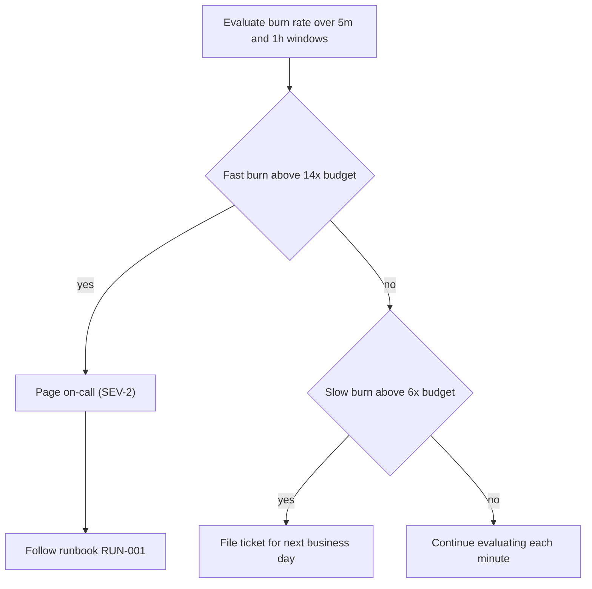

<!-- alert authoring skeleton (spec-objects-operational). Contract (manifest
     body_extraction):
     - Frontmatter MUST carry id, title, and artifact_type: alert.
     - "## Flow" (H2) is REQUIRED and MUST contain a fenced ```mermaid code
       block; its content is extracted as `flow`.
     - Mermaid rules: no semicolons in label text, no spaces in node ids,
       quote any node label containing parentheses. -->
# [ALR-001] Artifact-store availability burn-rate alert

Multi-window burn-rate alert against SLO-001. A fast burn pages the on-call
engineer immediately; a slow burn files a ticket for working hours.

## Flow


