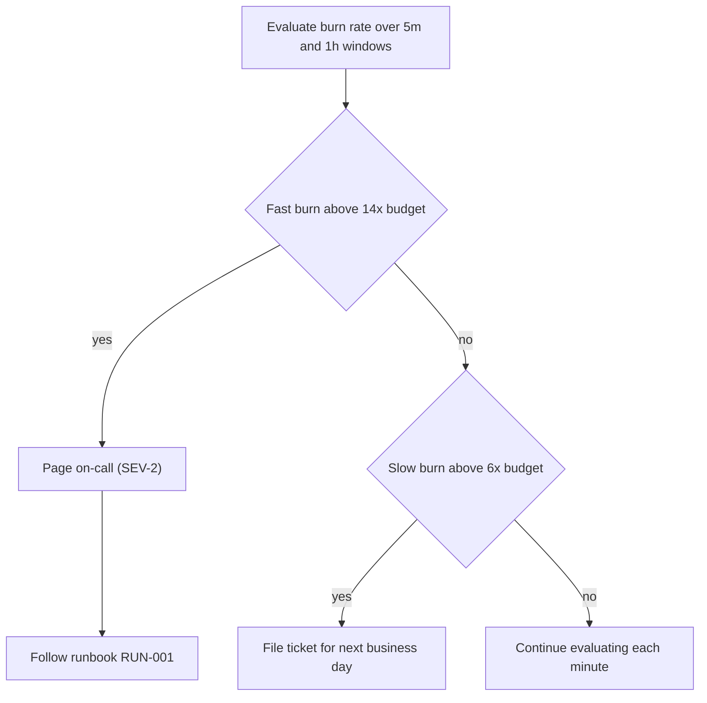

<!-- alert authoring skeleton (spec-objects-operational). Contract (manifest
     body_extraction):
     - Frontmatter MUST carry id, title, type: alert, object: alert.
     - An alert declares a CONDITION, not data: Alert.json forbids `fields`,
       so this skeleton carries NO "## Properties" section.
     - "## Invariants" (H2, REQUIRED by Alert.json): at least one clause —
       the firing condition. One `### <clauseId>` per clause, each owning one
       `ocl` fence.
     - "## Flow" (H2) is REQUIRED and MUST contain a fenced `mermaid` code
       block; its content is extracted as `flow`.
     - Mermaid rules: no semicolons in label text, no spaces in node ids,
       quote any node label containing parentheses. -->
# [ALR-001] ArtifactStoreBurnRate

Multi-window burn-rate alert against SLO-001. A fast burn pages the on-call
engineer immediately; a slow burn files a ticket for working hours.

## Invariants

The clauses the ArtifactStoreBurnRate declaration enforces. Each clause owns
one `ocl` fence under its own `### <clauseId>` heading; the fence text is
carried verbatim and never evaluated here.

### FastBurnPagesImmediately

```ocl
context ArtifactStoreBurnRate
inv FastBurnPagesImmediately:
  self.burnRate5m > 14 implies self.severity = AlertSeverity::page
```

### SlowBurnFilesTicket

```ocl
context ArtifactStoreBurnRate
inv SlowBurnFilesTicket:
  self.burnRate1h > 6 and self.burnRate5m <= 14 implies self.severity = AlertSeverity::ticket
```

## Flow


```mermaid
flowchart TD
  evalBurn["Evaluate burn rate over 5m and 1h windows"] --> fastBurn{Fast burn above 14x budget}
  fastBurn -->|yes| pageOncall["Page on-call (SEV-2)"]
  fastBurn -->|no| slowBurn{Slow burn above 6x budget}
  slowBurn -->|yes| fileTicket[File ticket for next business day]
  slowBurn -->|no| keepWatching[Continue evaluating each minute]
  pageOncall --> runbookRef[Follow runbook RUN-001]
```
