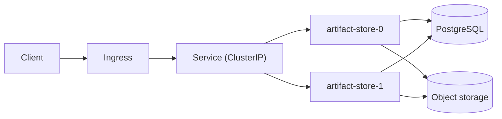

<!-- deployment authoring skeleton (spec-objects-operational). Contract
     (manifest body_extraction):
     - Frontmatter MUST carry id, title, and artifact_type: deployment.
     - "## Topology" (H2) is REQUIRED and MUST contain a fenced ```mermaid
       code block; its content is extracted as `topology`.
     - Mermaid rules: no semicolons in label text, no spaces in node ids,
       quote any node label containing parentheses. -->
# [DEP-001] Artifact-store production deployment topology

Two artifact-store replicas run behind a ClusterIP service and the shared
ingress. Both replicas talk to the same PostgreSQL instance for metadata and
the same object-storage bucket for blob payloads.

## Topology


