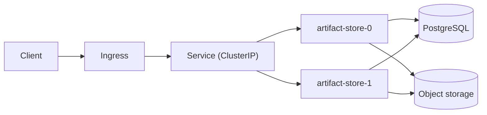

<!-- deployment authoring skeleton (spec-objects-operational). Contract
     (manifest body_extraction):
     - Frontmatter MUST carry id, title, type: deployment,
       object: deployment.
     - "## Properties" (H2): the typed declaration. Header exactly
       `Field | Type | Multiplicity | Constraints`. Deployment.json requires
       at least one `identity` row — the release identity. The declaration
       carries the release STRATEGY, never an executed rollout.
     - "## Operations" (H2, REQUIRED by Deployment.json): at least one
       lifecycle operation. One `### <name>` per operation, an optional
       `| Param | Type | Multiplicity | Constraints |` table, a `Returns:`
       line where the operation returns a value, and optional `Pre:`/`Post:`
       lines naming clause ids declared in this same artifact.
     - "## Invariants" (H2): one `### <clauseId>` per clause, each owning one
       `ocl` fence.
     - "## Topology" (H2) is REQUIRED and MUST contain a fenced `mermaid`
       code block; its content is extracted as `topology`.
     - Mermaid rules: no semicolons in label text, no spaces in node ids,
       quote any node label containing parentheses. -->
# [DEP-001] ArtifactStoreRelease

Two artifact-store replicas run behind a ClusterIP service and the shared
ingress. Both replicas talk to the same PostgreSQL instance for metadata and
the same object-storage bucket for blob payloads.

## Properties

| Field | Type | Multiplicity | Constraints |
|---|---|---|---|
| release_id | String | 1..1 | identity, pattern: /^[a-z0-9-]+$/ |
| image_digest | String | 1..1 | pattern: /^sha256:[0-9a-f]{64}$/ |
| replicas | Integer | 1..1 | min: 1, max: 16 |
| rollout_strategy | String | 1..1 | enumValues: recreate\|rolling\|blue_green\|canary |
| applied_configuration | ArtifactStoreConfiguration | 1..1 | |

## Operations

The lifecycle operations this deployment declares. Each operation owns one
`### <name>` heading with an optional parameter table, a `Returns:` line where
it returns a value, and `Pre:`/`Post:` lines where it names clauses declared
in this artifact.

### deploy

Roll the named image digest out to the replica set under the declared
strategy, waiting for readiness before reporting success.

| Param | Type | Multiplicity | Constraints |
|---|---|---|---|
| image_digest | String | 1..1 | pattern: /^sha256:[0-9a-f]{64}$/ |

Returns: Boolean[1..1]

Pre: ReplicaCountIsAtLeastTwo

### roll_back

Return the replica set to the previous known-good revision without touching
persistent state.

Returns: Boolean[1..1]

### scale

Change the replica count within the declared bounds; never below the count
the availability objective requires.

| Param | Type | Multiplicity | Constraints |
|---|---|---|---|
| replicas | Integer | 1..1 | min: 1, max: 16 |

Post: ReplicaCountIsAtLeastTwo

## Invariants

The clauses the ArtifactStoreRelease declaration enforces. Each clause owns
one `ocl` fence under its own `### <clauseId>` heading; the fence text is
carried verbatim and never evaluated here.

### ReplicaCountIsAtLeastTwo

```ocl
context ArtifactStoreRelease
inv ReplicaCountIsAtLeastTwo:
  self.replicas >= 2
```

### CanaryRolloutNeedsSpareCapacity

```ocl
context ArtifactStoreRelease
inv CanaryRolloutNeedsSpareCapacity:
  self.rollout_strategy = 'canary' implies self.replicas >= 3
```

## Topology


```mermaid
flowchart LR
  client[Client] --> ingress[Ingress]
  ingress --> svc["Service (ClusterIP)"]
  svc --> replicaA[artifact-store-0]
  svc --> replicaB[artifact-store-1]
  replicaA --> metadataDb[(PostgreSQL)]
  replicaB --> metadataDb
  replicaA --> blobBucket[(Object storage)]
  replicaB --> blobBucket
```
