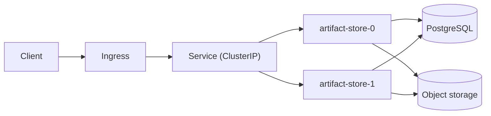

<!-- deployment authoring skeleton, alternate Properties form. Declares
     exactly the same fields as deployment.md, authored as one `sysml` fence
     instead of the typed table (FR-005-AC-2). One artifact carries one form;
     the alternate is a separate file, never a second block in the same
     artifact. -->
# [DEP-001] ArtifactStoreRelease

Two artifact-store replicas run behind a ClusterIP service and the shared
ingress. Both replicas talk to the same PostgreSQL instance for metadata and
the same object-storage bucket for blob payloads.

## Properties

```sysml
attribute release_id : String[1..1] { identity, pattern: /^[a-z0-9-]+$/ }
attribute image_digest : String[1..1] { pattern: /^sha256:[0-9a-f]{64}$/ }
attribute replicas : Integer[1..1] { min: 1, max: 16 }
attribute rollout_strategy : String[1..1] { enumValues: recreate|rolling|blue_green|canary }
ref item applied_configuration : ArtifactStoreConfiguration[1..1]
```

## Operations

The lifecycle operations this deployment declares. Each operation owns one
`### <name>` heading with an optional parameter table, a `Returns:` line where
it returns a value, and `Pre:`/`Post:` lines where it names clauses declared
in this artifact.

### deploy

Roll the named image digest out to the replica set under the declared
strategy, waiting for readiness before reporting success.

| Param | Type | Multiplicity | Constraints |
|---|---|---|---|
| image_digest | String | 1..1 | pattern: /^sha256:[0-9a-f]{64}$/ |

Returns: Boolean[1..1]

Pre: ReplicaCountIsAtLeastTwo

### roll_back

Return the replica set to the previous known-good revision without touching
persistent state.

Returns: Boolean[1..1]

### scale

Change the replica count within the declared bounds; never below the count
the availability objective requires.

| Param | Type | Multiplicity | Constraints |
|---|---|---|---|
| replicas | Integer | 1..1 | min: 1, max: 16 |

Post: ReplicaCountIsAtLeastTwo

## Invariants

The clauses the ArtifactStoreRelease declaration enforces. Each clause owns
one `ocl` fence under its own `### <clauseId>` heading; the fence text is
carried verbatim and never evaluated here.

### ReplicaCountIsAtLeastTwo

```ocl
context ArtifactStoreRelease
inv ReplicaCountIsAtLeastTwo:
  self.replicas >= 2
```

### CanaryRolloutNeedsSpareCapacity

```ocl
context ArtifactStoreRelease
inv CanaryRolloutNeedsSpareCapacity:
  self.rollout_strategy = 'canary' implies self.replicas >= 3
```

## Topology


